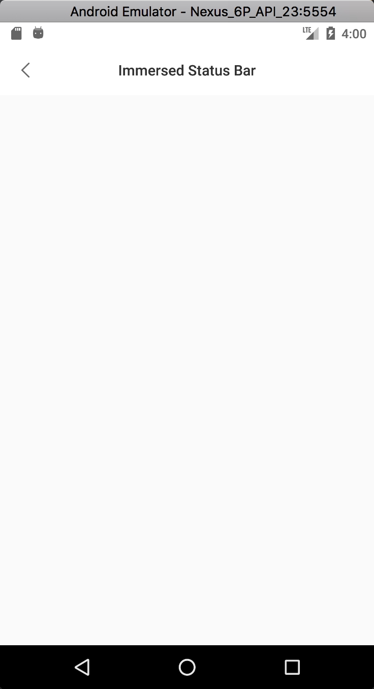
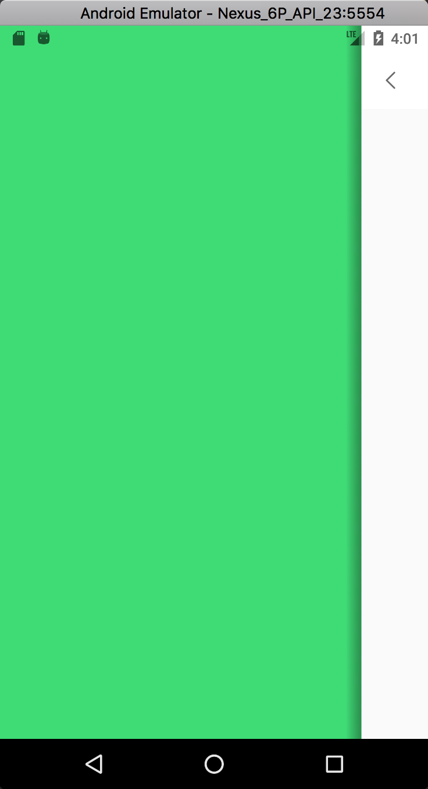
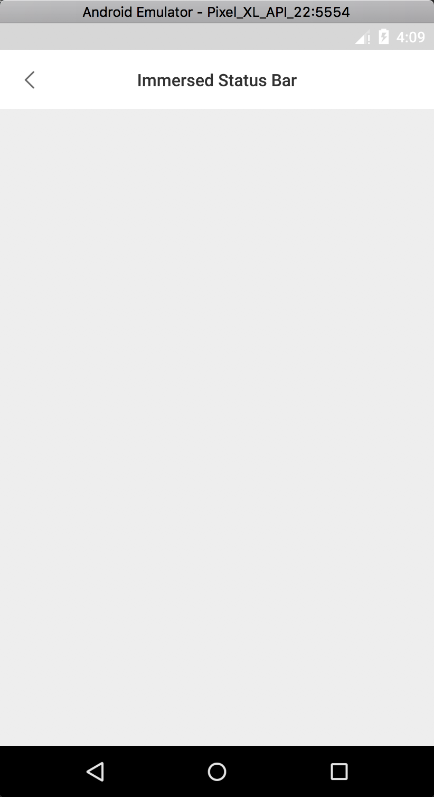
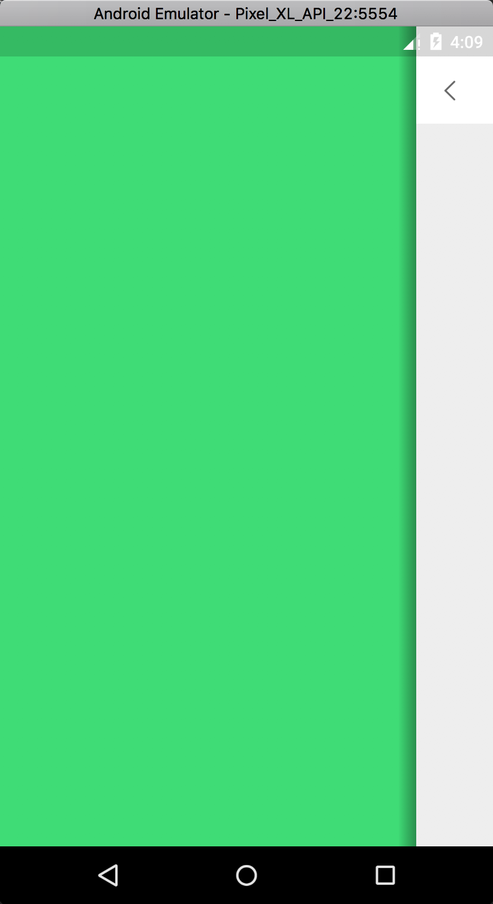
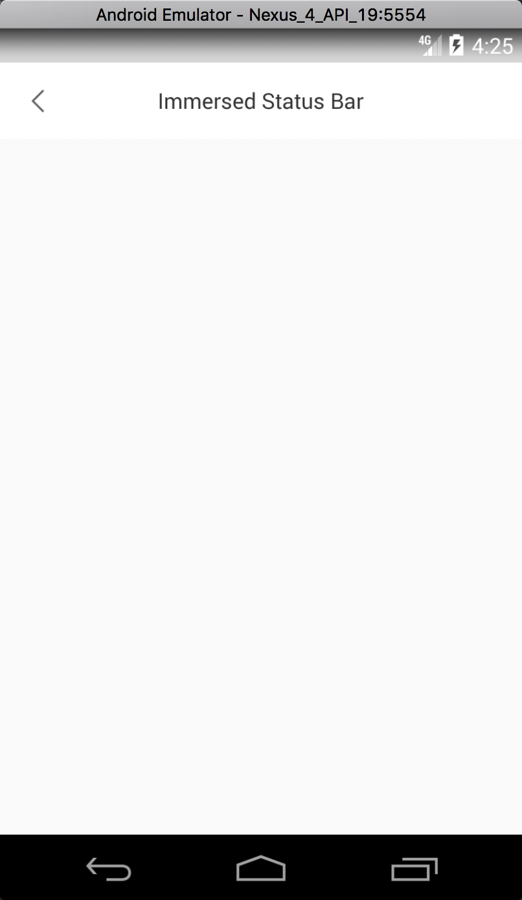
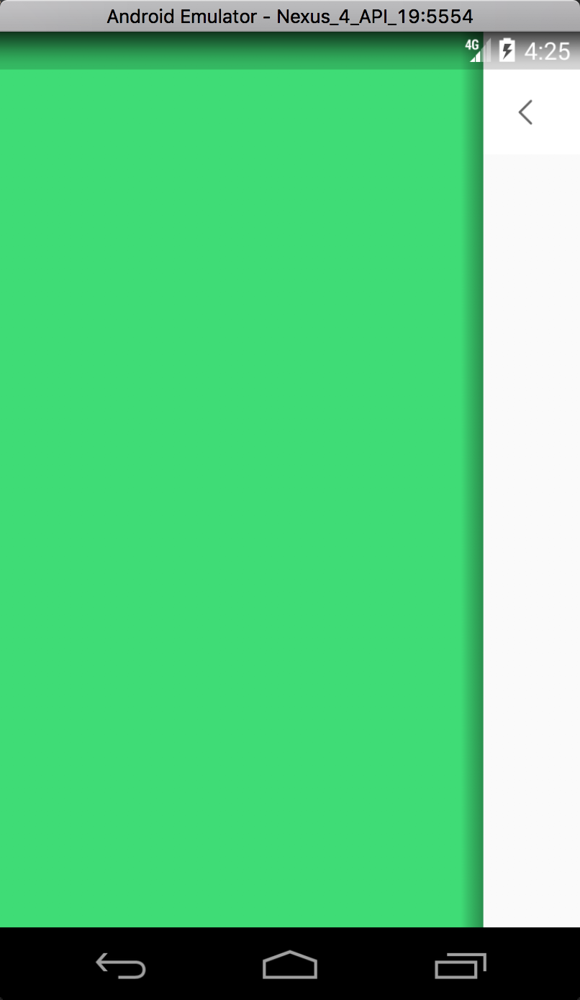

## Android沉浸式状态栏兼容方案
### 用途
重点针对浅色状态栏的适配, 即白底黑字, 具体应用可参见 微博  

[探究过程介绍](http://www.jianshu.com/p/648176c8b67e)

### 兼容方案 
1. 对于支持[状态栏透明 + 状态栏文字图标黑白切换]的机型(Android 6.0及以上, MIUI v6及以上, Flyme 4.0及以上), 全透明状态栏 + 黑色文字图标
2. 对于仅支持[状态栏透明]的机型(Android 4.4及其以上), 采用: 半透明状态栏 + 白色文字图标
3. 对于不支持的机型(Android 4.4以下), 采用默认状态: 黑色状态栏 + 白色文字图标

### 效果展示
##### 1. 对于情况1的显示效果

 

##### 2. 对于情况2的显示效果
- Android 5.x

 

- Android 4.4显示效果

 

##### 3. 对于情况3的显示效果略
..

### 使用
见Demo